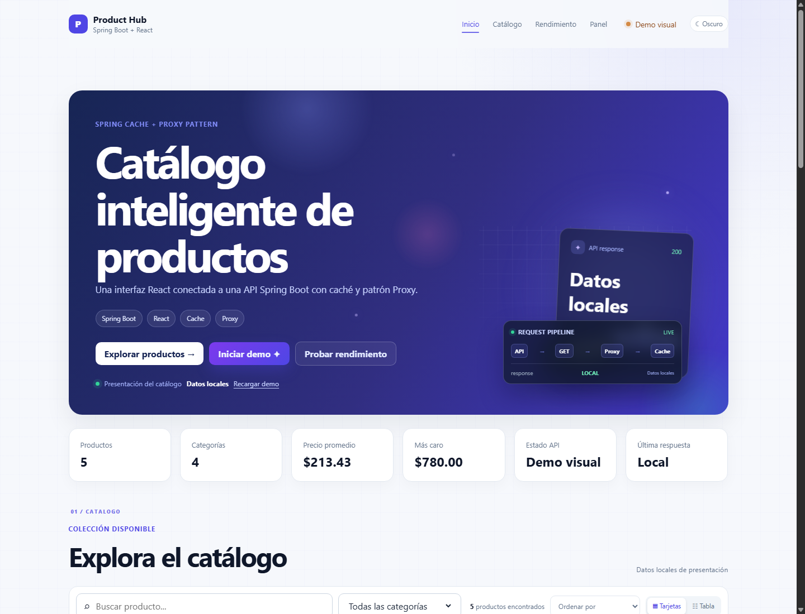
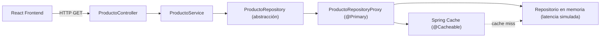
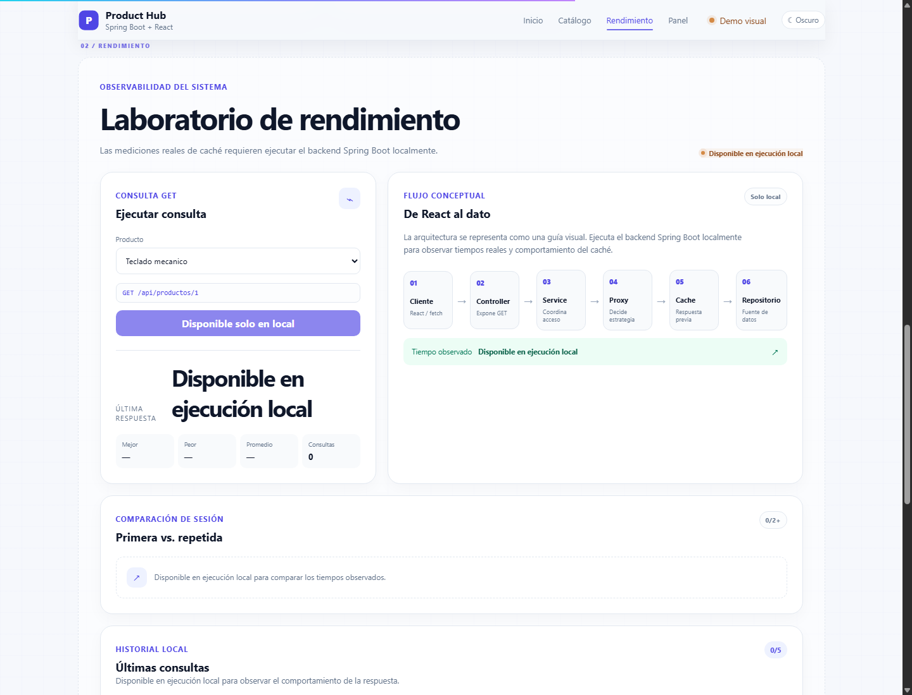
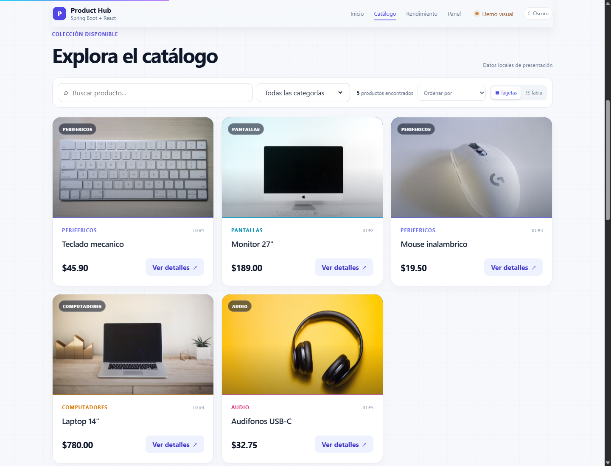
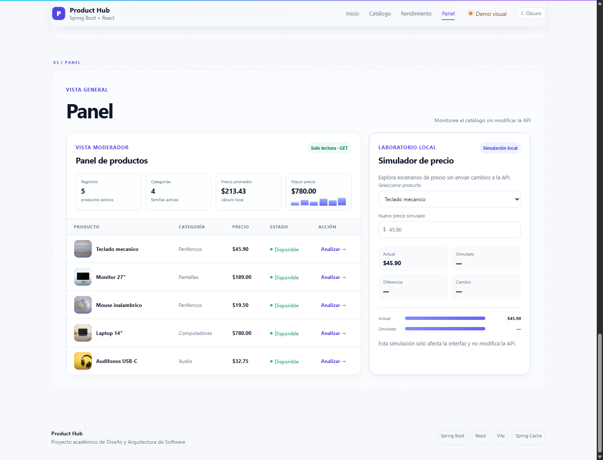

# Product Hub

### Spring Boot · React · Spring Cache · Proxy Pattern

Product Hub es una aplicación académica desarrollada para poner en práctica conceptos de Diseño y Arquitectura de Software mediante una API de productos en Spring Boot y una interfaz web construida con React.

[🌐 Ver demo pública](https://juliomm8.github.io/ISWZ2202-Spring-Cache-Proxy/) · [📦 Ver repositorio](https://github.com/Juliomm8/ISWZ2202-Spring-Cache-Proxy)



## Sobre el proyecto

Este proyecto nació como una actividad de Diseño y Arquitectura de Software. La aplicación base simulaba un acceso lento a datos, con aproximadamente 1.5 segundos de latencia por consulta. A partir de esa base se implementaron mecanismos para reducir accesos repetidos y se construyó una interfaz web para visualizar el resultado.

La actividad también involucraba completar una aplicación Java/Spring Boot, investigar el problema de CORS entre frontend y backend, trabajar con GitHub y generar una experiencia frontend que permitiera entender mejor el comportamiento de la API.

## ¿Qué se implementó?

### Backend

- Java 17 y Spring Boot 3.3.4.
- API REST de productos.
- `ProductoRepository` como abstracción para acceder a los datos.
- `ProductoRepositoryProxy` como intermediario del repositorio real.
- Repositorio en memoria con latencia simulada de 1500 ms.
- Caché con `@Cacheable` y activación mediante `@EnableCaching`.
- CORS para permitir el frontend local en `localhost:5173` y `127.0.0.1:5173`.

### Frontend

- React + Vite.
- Catálogo responsive con fotografías de productos.
- Búsqueda, filtros y ordenamiento.
- Vista de tarjetas y vista de tabla.
- Detalle de producto.
- Tema claro/oscuro y animaciones de interfaz.
- Modo demo guiado.
- Panel informativo y laboratorio de rendimiento.
- Simulador local de precios.
- Modo público para GitHub Pages con datos locales de presentación.

## Arquitectura



El controlador recibe las solicitudes HTTP y delega la operación al servicio. `ProductoService` depende de la abstracción `ProductoRepository`, no de una implementación concreta. En tiempo de ejecución, Spring inyecta el `ProductoRepositoryProxy` porque está marcado como `@Primary`.

El Proxy decide cómo intermediar el acceso y delega al repositorio en memoria cuando corresponde. La caché se encuentra en esa capa intermedia, antes de repetir la lectura costosa.

## Patrón Proxy

`ProductoRepositoryProxy` implementa la misma interfaz `ProductoRepository` que utiliza el servicio. Por eso `ProductoService` no necesita saber si está trabajando con el repositorio real o con el Proxy.

Esta decisión mantiene el servicio desacoplado de la implementación concreta y deja en el Proxy responsabilidades adicionales, como registrar la operación y aplicar la estrategia de caché. El repositorio en memoria sigue concentrado únicamente en entregar los datos.

## Caché y rendimiento

El repositorio en memoria tiene una latencia simulada de aproximadamente 1500 ms. Antes de aplicar caché, cada solicitud repetía esa espera. Con `@Cacheable`, la primera consulta obtiene el recurso desde el repositorio y una consulta repetida puede reutilizar el resultado almacenado.

Estas fueron las mediciones realizadas durante una ejecución local:

| Consulta | Primera petición | Petición repetida |
|---|---:|---:|
| Producto 1 | ~1625 ms | ~3.3 ms |
| Producto 2 | ~1524 ms | ~2.8 ms |

Los resultados fueron obtenidos durante pruebas locales y no representan un benchmark científico. Pueden variar ligeramente según el equipo y el momento de ejecución.



En la demo pública, el laboratorio se conserva como representación visual del flujo. Las mediciones reales de API y caché se realizan ejecutando el backend localmente.

## CORS en desarrollo

Durante el desarrollo se ejecutan dos servidores distintos:

- Frontend: `http://localhost:5173`
- Backend: `http://localhost:8080`

Aunque ambos usan `localhost`, los puertos son diferentes y, por lo tanto, representan orígenes distintos para el navegador. La clase `WebConfig` permite las solicitudes `GET` del frontend local hacia las rutas `/api/**`.

## Interfaz

### Catálogo



### Panel



### Laboratorio


Las imágenes anteriores son capturas reales de la versión publicada en GitHub Pages. La versión pública muestra el recorrido visual completo, incluyendo catálogo, filtros, panel y laboratorio.

## Demo pública

La interfaz está publicada en:

**[https://juliomm8.github.io/ISWZ2202-Spring-Cache-Proxy/](https://juliomm8.github.io/ISWZ2202-Spring-Cache-Proxy/)**

La publicación permite revisar el diseño y la experiencia visual sin instalar el proyecto. GitHub Pages publica contenido estático, por lo que el backend Spring Boot no está desplegado en esa URL.

### Importante

La versión pública utiliza el modo `VITE_PUBLIC_DEMO=true` del frontend. Ese modo carga los mismos cinco productos utilizados por la aplicación y evita depender de `localhost`.

La API real, las consultas individuales y las mediciones de caché se ejecutan en el entorno local.

### ¿Por qué la demo pública solo contiene el frontend?

El objetivo de la actividad era trabajar los conceptos de Spring, Proxy, caché, CORS y consumo de una API, no realizar un despliegue de producción completo. Para publicar también el backend habría sido necesario desplegar Spring Boot en un servicio adicional, cambiar la URL utilizada por el frontend y ampliar la configuración CORS para aceptar el nuevo dominio.

Para mantener el alcance de la entrega y no cambiar una implementación del backend que ya cumplía los requerimientos de la actividad, se decidió utilizar GitHub Pages únicamente como demostración visual del frontend. Las funciones relacionadas con la API real y las mediciones de caché permanecen disponibles durante la ejecución local.

| Entorno | Frontend | Backend | Datos | Uso |
|---|---|---|---|---|
| **Local** | React en `:5173` | Spring Boot en `:8080` | API real | Aplicación funcional y pruebas de caché |
| **GitHub Pages** | React público | No desplegado | Datos demo | Demostración visual |

## Ejecución local

### 1. Backend

Requiere Java 17 o una versión posterior. No es necesario instalar Maven porque el repositorio incluye Maven Wrapper.

En Windows:

```powershell
.\mvnw.cmd spring-boot:run
```

Backend:

```text
http://localhost:8080
```

Endpoints disponibles:

```text
GET http://localhost:8080/api/productos
GET http://localhost:8080/api/productos/{id}
```

### 2. Frontend

En otra terminal:

```powershell
cd frontend
npm install
npm run dev
```

Frontend:

```text
http://localhost:5173
```

En ejecución local, el frontend utiliza la API real de Spring Boot. El modo público de GitHub Pages se activa únicamente cuando el build define `VITE_PUBLIC_DEMO=true`.

## Estructura del proyecto

```text
demo-app-estudiantes/
├── src/main/java/com/udla/arquitectura/demo/
│   ├── config/
│   ├── controller/
│   ├── model/
│   ├── repository/
│   └── service/
├── frontend/
│   ├── src/components/
│   ├── src/hooks/
│   └── src/services/
├── docs/images/
├── .github/workflows/
├── pom.xml
├── mvnw
└── mvnw.cmd
```

## Tecnologías utilizadas

### Backend

- Java 17
- Spring Boot
- Spring Web
- Spring Cache
- Maven

### Frontend

- React
- Vite
- JavaScript
- CSS

### Despliegue

- Git
- GitHub
- GitHub Actions
- GitHub Pages

## Decisiones de diseño

- El servicio depende de `ProductoRepository`, no del repositorio en memoria.
- El Proxy conserva la misma abstracción que consume el servicio.
- La caché evita repetir lecturas con latencia simulada.
- El acceso a la API está separado de los componentes visuales del frontend.
- La URL de la API está centralizada en el servicio de productos.
- El modo público de Pages está separado del modo local mediante `VITE_PUBLIC_DEMO`.
- GitHub Actions publica solamente el contenido construido dentro de `frontend/dist`.

## Resultado

La aplicación permite observar de forma práctica la diferencia entre consultar siempre el repositorio y reutilizar resultados mediante caché. Además, el frontend permite explorar el catálogo, filtrar productos, revisar detalles y visualizar el flujo de la arquitectura de una forma más clara.

El proyecto mantiene separadas las responsabilidades del controlador, servicio, repositorio, Proxy y presentación. El desarrollo se realizó de forma incremental mediante commits separados para Proxy, caché, CORS, frontend, experiencia de usuario y despliegue.
